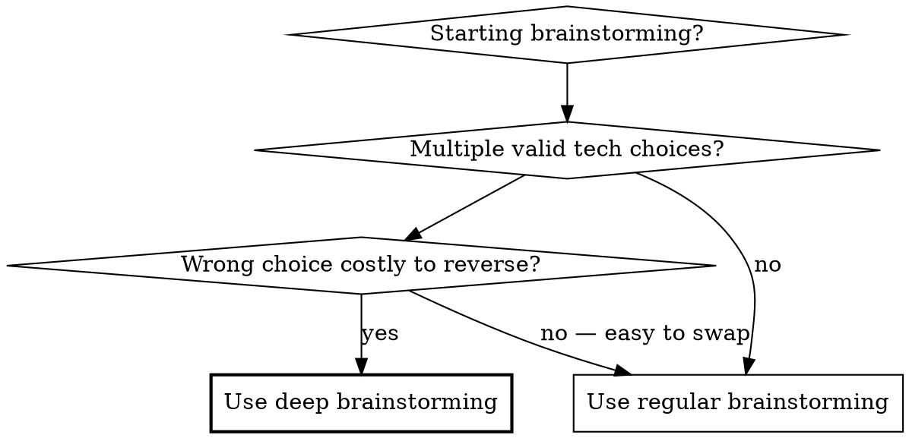

# Deep Brainstorming

Research-hardened brainstorming that catches biases agents naturally introduce. Collapses what would otherwise be 3-4 sessions of iterative discovery into one disciplined session.

**REQUIRED:** Run a standard brainstorming pass first (e.g., `superpowers:brainstorming` or equivalent). This skill augments brainstorming output — it does not replace it.

## When to Use

## Intensity Selector

Pick intensity based on stakes and time budget. Default to **Standard** unless stakes clearly call for Quick or Thorough.

| Level | Research Rounds | Bias Audit | Review Phases | When |
|-------|----------------|------------|---------------|------|
| **Quick** | 1 round, 2-3 agents | Spot-check top recommendation | Verify-fix only | Low-stakes, easily reversible |
| **Standard** | 2 rounds, 3-4 agents each | Full 9-type audit after each round | Verify-fix + adversarial | Default for most architecture decisions |
| **Thorough** | 3-4 rounds, 4-6 agents each | Full audit + retroactive sweep | All 3 phases + independent re-verification | High-stakes, expensive to reverse, novel domain |

## Process Overview

| Phase | What | Why |
|-------|------|-----|
| 1. Sanitize vision | Strip tool/vendor names from requirements | Prevents anchoring bias in research |
| 2. Research rounds | Parallel agents with clean prompts, progressive debiasing | Catches marketing/popularity bias |
| 3. Bias audit | Check each round's output against 9 bias types | Agents over-represent popular tools |
| 4. Independent verify | Check key claims via web/docs yourself | Catches hallucinated benchmarks |
| 5. Claim provenance | Record source, quote, verification method for every cited number | Prevents stat drift across sessions |
| 6. Assemble spec | Progressive file capture, one section at a time | Survives compaction |
| 7. Three-phase review | Verify-fix, adversarial, security/ops | Each type catches different classes of bugs |
| 8. Quality gate | "Is this objectively best?" challenge on final spec | Catches premature satisfaction |

## Phase 1: Sanitize the Vision

Extract the client brief into a clean requirements document. This is the anchor for all research.

**Strip:** All tool names, frameworks, architecture patterns, vendor references.
**Keep:** What it does, who uses it, hard constraints (language, platform, compliance).
**Save as:** `<project-docs-dir>/<project>-vision.md`

**Scoping discipline:** Only include requirements the client actually stated. If a requirement wasn't in the brief, it doesn't belong in the vision. Agents inject phantom requirements from training data (compliance frameworks, accessibility standards, monitoring stacks). Challenge every requirement: "Did the client ask for this, or did an agent add it?"

**Non-Requirements section:** Explicitly list what the client did NOT ask for in the vision doc. This is the primary defense against phantom requirements — research agents that recommend solutions to Non-Requirements get flagged immediately.

## Phase 2: Research with Clean Prompts

**Prompt rules:**
- Zero vendor/tool names — only functional requirements + vision doc
- "What's the best way to achieve Y?" not "Is X good for Y?"
- Include: "Verify non-library claims via web search. Do not rely on training data."
- Attach the sanitized vision document to every prompt

**Agent discipline (mandatory for ALL researcher agents):**
- **Synthesize first:** Every researcher prompt MUST include: "SYNTHESIZE FIRST — write your findings report before doing more searches. You can always search more after writing what you know." Without this, agents spend 80%+ of their token budget on searches and never produce output. (Evidence: 60% researcher agent failure rate observed from token exhaustion on web-search-heavy tasks.)
- **Max 5 questions per agent.** Split larger research across parallel agents. One agent with 10 questions will exhaust tokens on the first 5 and never synthesize. Each agent gets 3-5 focused questions.
- **Structured doc tools for library docs.** Prefer structured documentation sources (e.g., Context7 MCP, official API docs) over generic web search for library API verification. Structured docs return focused content at lower token cost than web search chains.
- **Relaunch failed agents.** When a researcher fails to synthesize (returns partial output like "Let me search for more..."), relaunch with a shorter prompt. Doing the research inline burns 5-10x more main context.

**Round structure:**
- Split research by domain (e.g., backend, frontend, data pipeline, infrastructure, NLP)
- One agent per domain per round, all running in parallel
- Round 1: broad discovery — "What are the top approaches for [functional need]?"
- Round 2: verification with **fresh prompts** that do NOT reference Round 1 findings. Ask the same functional questions differently. Compare convergence.
- Round 3+ (Thorough only): targeted investigation of divergences between rounds

**Consensus guard:** If all agents in a round converge on the same tool, that's a red flag — not validation. Force dissent: "What's the strongest alternative to [consensus pick] and under what conditions would it win?"

**Prompt review cycle:** Before launching each round, present prompts to the user for review and revision. Agents internalize biased framing invisibly — the user catches phrasing that anchors research. Specific things to check: did any functional description smuggle in a tool name? Did "agentic orchestration" imply a specific architecture? Soften loaded terms to neutral descriptions.

**Full reset option (Thorough):** For the final research round, discard all prior findings: "All previous research counts as zero. Start from the requirements only." This prevents anchoring to earlier rounds' conclusions and surfaces genuinely different approaches.

**Convergence table:** After each round, produce a cross-round comparison table showing every decision layer with what each round recommended. Items that converge across rounds get high confidence. Items that diverge get "benchmark to decide" status. This table is the primary decision tool — not any single round's output.

For detailed prompt templates, see [references/research-prompts.md](references/research-prompts.md).

## Phase 3: Bias Audit

Check after EVERY research round. Audit the full output, not just the recommendations.

| Bias | Signal | Detection |
|------|--------|-----------|
| **Marketing** | Most-blogged tool recommended as best | Check: is the recommendation backed by benchmarks or by blog post count? |
| **Popularity** | Most-downloaded/starred treated as winner | Check: do downloads measure quality or awareness? |
| **License** | Defaulting to OSS or to commercial without comparison | Check: was the full landscape evaluated, or just one license type? |
| **Information landscape** | Domain keywords trigger unrelated associations | Check: is the recommendation actually relevant to THIS use case? |
| **Training data** | Stale versions, deprecated tools, renamed SDKs | Check: verify version numbers and project status against official sources |
| **Vendor benchmark** | Performance numbers sourced from the tool's own maker | Check: find independent verification or note as unverified |
| **Hallucinated evidence** | Specific benchmark numbers or repo URLs that don't exist | Check: locate the original source. If source doesn't exist, the claim is fabricated. (e.g., agent cites "93.2% MAP" for a tool — number not on any leaderboard) |
| **Consensus blindspot** | All agents converge but miss actual leaders | Check: when ALL agents agree, force dissent AND verify against authoritative leaderboards/rankings. (e.g., all agents recommend tool X while leaderboard shows Y and Z rank higher) |
| **Phantom requirements** | Agent adds requirements the client never stated | Check: trace every requirement to the client brief. If not there, it's phantom. (e.g., agent injects compliance framework triggered by a keyword in the brief) |

**Retroactive sweep:** Bias found in one section means the same bias likely exists in ALL sections. Audit every previous section for the same pattern before proceeding.

## Phase 4: Independent Verification

Do not trust agent output for factual claims. The orchestrator verifies directly — not via more agents. The orchestrator has full synthesis context and can cross-reference claims against actual leaderboard URLs in a way a fresh agent cannot.

**Positive claims (assertions):**
- **Benchmark numbers** → find the original leaderboard or paper
- **"#1" / "best" claims** → verify against the cited source (not a blog post about it)
- **Version numbers** → check official release pages
- **"Supports X" claims** → check official docs, not third-party posts
- **Pricing/licensing** → check the vendor's current pricing page

**Negative claims ("X doesn't exist") — NEVER accept from a single agent:**
- Agent searches can miss things. "X doesn't exist" requires LOCAL verification:
  - Model existence → HuggingFace API query (not pip — pip checks packages, not model registries)
  - Package existence → `pip index versions X` or PyPI search
  - Import path → `python -c "from X import Y"`
  - Version → `pip show X` or official docs
- Evidence: agent said "Model X not publicly available" (HuggingFace API showed it exists). Another agent said "Library v5 doesn't exist" (official docs confirmed v5). Both premature dismissals accepted from single agents, reversed by local checks.
- **Rule:** Only accept negative claims after local verification produces the same conclusion.

**Verification chain termination — three types of evidence that break the loop:**
1. **Direct local** (highest): `pip show`, `pip index versions`, `python -c`, HuggingFace API
2. **Multi-source convergence** (good): 2+ independent agents agree via different methods
3. **Implementation** (ultimate): if it imports and runs, it works

Agents verifying agents is infinite recursion. Only local verification produces ground truth.

**Synthesis robustness audit:** Before moving from research to design, categorize EVERY recommendation into three tiers:
1. **Robust** — independently verified from 2+ sources across multiple rounds
2. **Single-source** — one round found it, or only one source confirms it
3. **Unverified** — agent-generated, no independent confirmation found

Only Robust items enter the spec with confidence. Single-source items enter with caveats. Unverified items are dropped or flagged for benchmarking.

## Phase 5: Claim Provenance

For every cited number, benchmark, or attributed claim, record:

| Field | What to capture |
|-------|----------------|
| **Claim** | The exact assertion (e.g., "11.4x faster than pgvector") |
| **Source** | Title, authors, DOI/URL |
| **What source says** | Direct quote, not paraphrase |
| **Verification** | Method used (which agents, which URLs, how many confirmed) |
| **Status** | Verified (2+ sources) / Single-source / Unverified / Vendor-only |
| **Date** | When verified |

Mark unverified claims explicitly in the spec. Never let an unverified claim propagate into planning.

## Phase 6: Progressive File Capture

Write each design section to a file as it's approved. Assemble into one spec at the end.

- One file per section: `<project-docs-dir>/<project>-section-N-<topic>.md`
- Each file includes its provenance records
- Assemble final spec from approved section files — not from memory
- Final spec replaces section files (they were scaffolding)

This protects against context compaction losing approved work.

## Phase 7: Three-Phase Review

After assembling the spec, run the review phases required by your selected intensity level. Each phase is a separate agent with NO context from prior phases.

**Phase R1 — Verify-fix:** Standard review for consistency, completeness, formatting. Fix issues, verify fixes are clean.

**Phase R2 — Adversarial (MANDATORY for Standard+):** "You are reviewing a spec that passed standard review. Your job is to find what the standard review missed. Don't trust the previous approval. Challenge every architectural claim, every tool selection, every assumption. Find contradictions between sections."

**Phase R3 — Security/Operations:** "Focus exclusively on: security vulnerabilities, scalability bottlenecks, error handling gaps, deployment complexity, testing gaps, operational burden. Ignore formatting and style."

Each phase must end with a clean verification pass before proceeding to the next.

**Anti-skip rule:** "The plan already went through N agents" is the EXACT rationalization this rule targets. Different phases catch different classes of issues. R1 catches consistency. R2 catches architectural contradictions and YAGNI. R3 catches security/ops gaps. Evidence: adversarial review has caught 7+ YAGNI violations and multiple critical issues invisible to standard review and to deepening agents in real use. Skipping R2 because "agents already reviewed" is the single most expensive mistake in this process.

**Finding engagement depth:** For each finding from any review phase, READ the actual code cited (not the reviewer's summary), VERIFY the claim is real, ESTIMATE fix cost, and FIX if cheaper than documenting a deferral. "Tracked as deferred" is not engagement — it's categorization theater. If the fix is 1-5 lines, just fix it.

For exact review prompts, see [references/review-protocols.md](references/review-protocols.md).

## Phase 8: "Objectively Best?" Quality Gate

After all reviews pass, challenge the entire spec one final time.

**Protocol:**
1. Re-read the spec from scratch (not from memory of writing it)
2. For each major decision: "Is this the objectively best choice, or did we settle?"
3. For each claim: "Is this verified, or did we trust an agent?"
4. For each omission: "Did we skip this because it doesn't matter, or because it was hard?"

This gate has surfaced real issues in every single use. It is not optional.

**When the gate surfaces issues:** Fix the issue, then re-run the relevant review phase (not just the gate). The gate is a detector, not a fixer — changes made in response need the same review rigor as the original spec.

**Self-assessment is not verification.** Evaluating your own work against your own criteria is circular. Re-read actual source artifacts fresh.

## Transition to Planning

After the spec is approved:

1. **Spec code is illustrative, not verified.** Examples in the spec are for communication — they may use stale APIs or wrong syntax. Dispatch research agents to verify spec code against current API docs BEFORE writing plan code.
2. **Each plan section needs its own research agent** to verify the spec's assumptions against current reality.
3. **The brainstorm spec is the plan's input, not its source of truth.** Plans must cite current documentation, not the spec's examples.

## The 9 Bias Types (Quick Reference)

| Bias | One-line test |
|------|--------------|
| Marketing | "Is this recommended because it's best, or because it's most-marketed?" |
| Popularity | "Do downloads/stars measure quality or awareness?" |
| License | "Did we evaluate the full landscape or just one license type?" |
| Info landscape | "Is this recommendation actually relevant to OUR use case?" |
| Training data | "Is this version/name current? Check official sources." |
| Vendor benchmark | "Who ran this benchmark? Find independent verification." |
| Hallucinated evidence | "Does the cited source actually exist? Locate the original." |
| Consensus blindspot | "All agents agree — did they check leaderboards, or echo each other?" |
| Phantom requirements | "Did the client ask for this, or did an agent add it?" |

## Common Mistakes

| Mistake | What happens | Fix |
|---------|-------------|-----|
| Tool names in research prompts | Agents anchor, don't discover alternatives | Only describe functional requirements |
| Trust agent benchmark numbers | Hallucinated or vendor-sourced numbers persist | Verify every number against original source |
| Fix bias in one section only | Same bias exists in all — fixed one, missed five | Retroactive audit after any bias found |
| Standard review only | Misses architectural contradictions and security gaps | All three review phases |
| Open-source default | Excludes potentially better commercial options | Evaluate full landscape, quality-first |
| All agents agree | Treated as validation when it's consensus bias | Force dissent — find the strongest alternative |
| Unverified claims enter planning | Bad numbers propagate and compound | Claim provenance tracking with status field |
| Self-assessment as verification | Circular — checking your work against your own criteria | Re-read source artifacts fresh, use independent agent |
| Phantom requirements | Agents inject requirements the client never stated | Check every requirement against the actual brief |

## Red Flags — STOP and Re-examine

- Research prompt mentions a specific tool by name
- All agents in a round converge on the same popular tool
- Benchmark number cited without original source
- All candidates are one license type only (OSS-only or commercial-only)
- Standard review passed but no adversarial or security review done
- Bias found in section 3 but sections 1, 2, 4-6 not re-audited
- Agent output trusted without independent web verification
- A requirement appears that the client never stated
- "Objectively best?" gate skipped or answered with "yes, I'm confident" without re-reading
- Agent says "X doesn't exist" and you accept it without local verification
- Researcher agent returns partial output ("Let me search for more...") and you move on
- "The plan already went through N agents" used to skip a review phase
- Review findings categorized but not actually read (batch disposition without code reading)

## Checklist

Items marked (S) = Standard+Thorough only. Items marked (T) = Thorough only. Unmarked = all intensities.

- [ ] Vision sanitized (zero tool names, zero phantom requirements, Non-Requirements section)
- [ ] User reviewed and revised research prompts before launch
- [ ] Research Round 1 (clean prompts, parallel agents, vision attached)
- [ ] Bias audit on Round 1 (Quick: spot-check only; Standard+: all 9 types + retroactive sweep)
- [ ] (S) Research Round 2 (fresh prompts, no Round 1 references)
- [ ] (S) Convergence table (Round 1 vs Round 2 comparison)
- [ ] (S) Bias audit on Round 2
- [ ] (T) Research Round 3+ (targeted divergences or full reset)
- [ ] Consensus guard applied (forced dissent if unanimous)
- [ ] All researcher prompts include "SYNTHESIZE FIRST" and max 5 questions
- [ ] Structured doc sources used for library verification (not just web search)
- [ ] Independent verification of key claims (orchestrator directly, not more agents)
- [ ] Negative claims verified locally (pip, HF API, python -c) — never trust single agent
- [ ] Synthesis robustness audit (every item: robust / single-source / unverified)
- [ ] Claim provenance recorded (source, quote, status)
- [ ] Design sections approved + written to files
- [ ] Spec assembled from section files
- [ ] Review R1: verify-fix → clean
- [ ] (S) Review R2: adversarial → clean
- [ ] (T) Review R3: security/ops → clean
- [ ] Retroactive consistency verified across all sections
- [ ] "Objectively best?" quality gate passed (re-read fresh, not from memory)
- [ ] Transition notes for planning (spec code marked as illustrative)
- [ ] User reviews final spec
