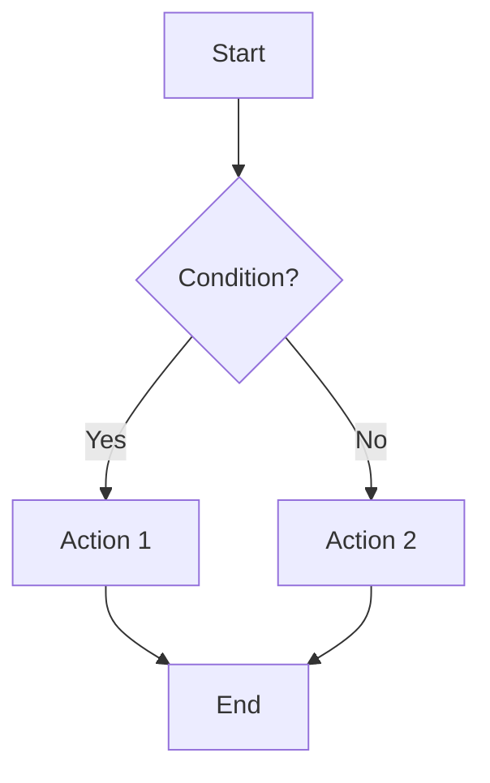
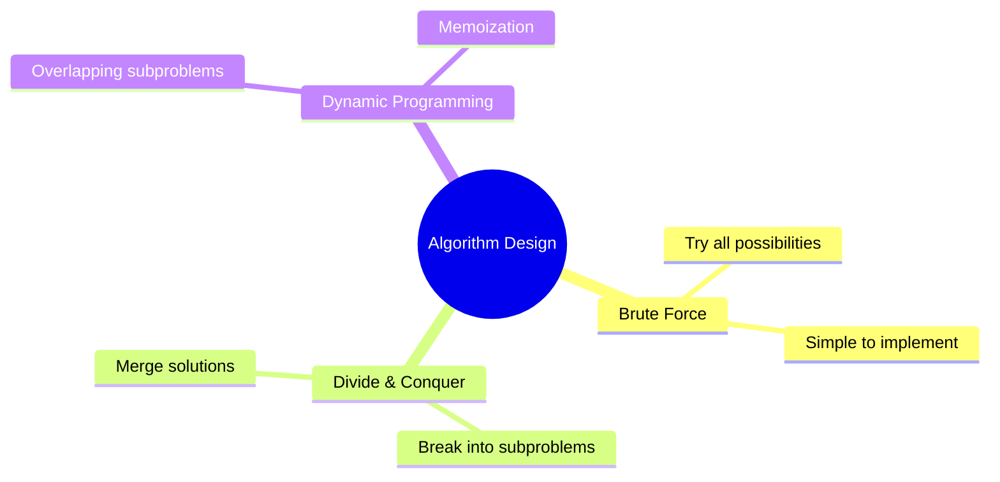
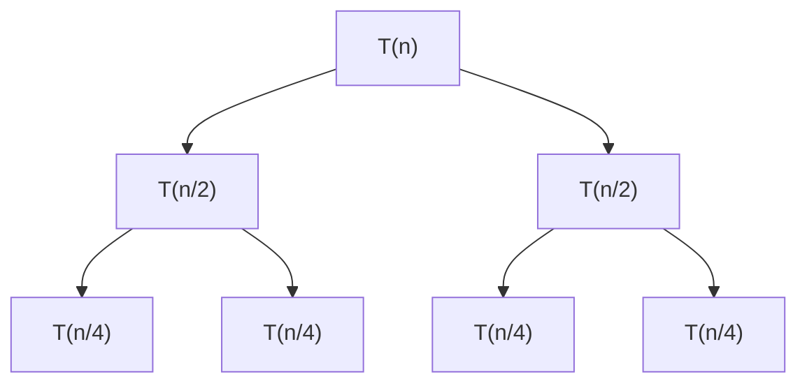

# Obsidian Study Vault Builder

> **Comprehensive patterns for building exam-ready study vaults in Obsidian**

Build structured, mobile-compatible academic study vaults with systematic error prevention, quality assurance, and efficiency patterns extracted from real-world projects.

## When to Use This Skill

Invoke when building academic study materials in Obsidian for:
- Final exam preparation (any subject)
- Course knowledge organization (CS, medicine, business, law, etc.)
- Self-study material structuring
- Technical documentation vaults
- Large-scale study projects (10+ files, 200KB+)

**Works across all subjects:**
- Computer Science (algorithms, data structures, systems)
- Medicine (anatomy, pharmacology, pathology)
- Business (finance, marketing, operations)
- STEM (physics, chemistry, engineering)
- Humanities (history, literature, philosophy)


---

## Core Methodology

### Checkpoint-Based Workflow (Critical)

**Never generate all chapters upfront.** Use progressive checkpoints:

1. **Chapter 1 Generation** → STOP
2. **User Review** → Approve format, structure, quality
3. **Chapters 2-N** → Continue with validated pattern
4. **Final QA** → Systematic verification

**Why this matters:**
- Catches format issues before they multiply across 30+ files
- Validates approach matches user needs early
- Adjusts course when cheap (Chapter 1) vs expensive (Chapter 8)
- Prevents 5+ hours of rework

**Time breakdown:**
- Chapter 1 only: ~30 min
- Review + fixes: ~15 min
- Chapters 2-8: ~90 min
- **Total:** ~2.5 hours vs 80 hours manual

### Memory File Hierarchy (Three Levels)

Academic vaults use hierarchical context files:

**Level 1: Root Vault** (`C:\Users\elzai\obsidian\CLAUDE.md`)
- Vault-wide conventions
- Universal formatting standards (Mermaid, LaTeX, callouts)
- Folder organization principles

**Level 2: School Folder** (`C:\Users\elzai\obsidian\School\CLAUDE.md`)
- Academic-specific patterns
- Study material philosophy
- Exam preparation approaches
- Course material locations

**Level 3: Course Project** (`C:\Users\elzai\obsidian\School\algorithms\CLAUDE.md`)
- Course-specific details (chapters covered, exam date, instructor style)
- File inventory (37 files complete)
- Status tracking (98% complete, QA in progress)
- Specific error fixes applied

**Pattern:** Each level inherits from parent, adds specific context.

**Benefits:**
- Claude gets appropriate detail at each scope
- No redundant information
- Easy to maintain
- Scales to multiple courses

---

## Obsidian-Specific Best Practices

### Universal Features Only (Mobile-First)

**Use these (work everywhere):**
- ✅ **Mermaid diagrams** - Flowcharts, graphs, trees, mind maps
- ✅ **LaTeX math** - Inline `$O(n)$`, block `$$\sum...$$`
- ✅ **Callouts** - `> [!note]`, `> [!tip]`, `> [!warning]`, `> [!example]`
- ✅ **Internal links** - `[[file]]`, `[[path/to/file|text]]`
- ✅ **Tables** - Standard markdown tables
- ✅ **Code blocks** - Syntax highlighting

**Never use (plugin-dependent):**
- ❌ Dataview queries
- ❌ Custom callout types (stick to standard 6)
- ❌ Embedded queries
- ❌ Plugin-specific syntax

**Why:** Students study on phones/tablets during commutes. Plugin-free = works everywhere.

### Internal Link Formats

**Correct patterns:**

```markdown
<!-- Relative links (preferred for portability) -->
[[../folder/file|Link Text]]
[[./sibling-file|Link Text]]

<!-- Absolute from vault root (works but less portable) -->
[[algorithms/01-introduction/core-concepts|Introduction]]

<!-- Section links -->
[[file#Section Name|Link Text]]
[[../cross-chapter/catalog#Sorting Algorithms|All Sorting]]

<!-- Same file section -->
[[#Section Name]]
```

**Common mistakes:**

```markdown
<!-- ❌ Wrong: Missing ../ for parent folder -->
[[cross-chapter/catalog#Sorting|Link]]

<!-- ❌ Wrong: Incorrect section name (case-sensitive) -->
[[catalog#sorting algorithms|Link]]  <!-- Should be "Sorting Algorithms" -->

<!-- ❌ Wrong: Using fragment that doesn't exist -->
[[catalog#Sorts|Link]]  <!-- Section is "Sorting Algorithms" not "Sorts" -->
```

**Validation:**
1. Open file in Obsidian
2. Click every internal link
3. Verify destination matches expectation
4. Fix broken links immediately (don't accumulate)

### Mermaid Diagram Patterns

**Flowcharts:**

```markdown

```

**Mind Maps:**

```markdown

```

**Recursion Trees:**

```markdown

```

**Critical: Special Character Handling**

Mermaid breaks with Unicode special characters. Use ASCII equivalents:

| Unicode | ASCII | Context |
|---------|-------|---------|
| ≤ | `<=` | Comparisons |
| ≥ | `>=` | Comparisons |
| ≠ | `!=` | Not equal |
| ∞ | `inf` or `infinity` | Bounds |
| ∈ | `in` | Set membership |

**Example fix:**

```markdown
<!-- ❌ WRONG: Unicode breaks rendering -->
A["i ≤ n"] --> B

<!-- ✅ CORRECT: ASCII works everywhere -->
A["i <= n"] --> B
```

**Escaped pipes in tables:**

When showing mermaid inside markdown tables, escape pipes:

```markdown
| Code | Diagram |
|------|---------|
| `if \|V\| > 5` | Graph nodes |
```

### LaTeX Math Notation

**Inline math:**

```markdown
The complexity is $O(n \log n)$ in the average case.
Time: $T(n) = 2T(n/2) + O(n)$
```

**Block math:**

```markdown
$$
T(n) = \begin{cases}
O(1) & \text{if } n = 1 \\
2T(n/2) + O(n) & \text{if } n > 1
\end{cases}
$$
```

**Summations:**

```markdown
$$
\sum_{i=1}^{n} i = \frac{n(n+1)}{2}
$$
```

**Critical: Escaping in Tables**

LaTeX pipes (`|`) inside markdown tables need escaping:

```markdown
| Set Operation | Notation |
|---------------|----------|
| Cardinality | $\|V\|$ means size of V |  <!-- ❌ BREAKS TABLE -->
| Cardinality | $\\|V\\|$ means size of V | <!-- ✅ WORKS -->
```

**Pattern:** Use double backslash `\\|` for pipes inside LaTeX in tables.

### Collapsible Solutions (Critical Pattern)

**Every practice problem must have collapsible solution:**

```markdown
## Problem 1: Algorithm Design

Design a system for customer lookup with 1M records...

> [!example]- Solution
>
> **Algorithm Choice:** Binary Search Tree
>
> **Analysis:**
> - Current: Linear search = O(n) = 1M comparisons = 5 seconds
> - BST: O(log n) = 20 comparisons = 5ms
> - Improvement: 1000x faster
>
> **Implementation:**
> ```python
> class CustomerDB:
>     def __init__(self):
>         self.bst = BST()
> ```
>
> **Complexity:**
> - Search: O(log n)
> - Insert: O(log n)
> - Space: O(n)
```

**Why collapsible:**
- Students try problem first (active recall)
- Peek at solution only if stuck
- Prevents passive reading

**Format requirements:**
1. Use `> [!example]-` (note the minus sign for collapsed)
2. Blank line after opening
3. Indent all content with `> `
4. Include reasoning, not just answer

### Callout Types (Standard Only)

**Use these six standard callouts:**

```markdown
> [!note] Key Concept
> Binary search requires sorted input

> [!tip] Study Strategy
> Practice on paper before coding

> [!warning] Common Mistake
> Off-by-one errors in loop bounds

> [!example] Scenario
> Design a cache with 1000 entries...

> [!info] Additional Context
> This was introduced in 1960s

> [!question] Practice Question
> What's the time complexity?
```

**Never use:**
- Custom types (`[!success]`, `[!danger]`, etc.) - not standard
- More than 2-3 callouts per section - overwhelming

---

## Content Quality Patterns

### Applied Understanding (Not Memorization)

**Bad questions:**
- "What is the time complexity of binary search?" → Memorization
- "List the steps of merge sort" → Rote recall
- "Define divide and conquer" → Definitions

**Good questions:**
- "Design a customer lookup system for 1M records. Current linear search takes 5s. Describe an algorithm to reduce to milliseconds. Analyze complexity and justify your choice." → Applied understanding
- "Your video streaming service buffers too often. Propose a caching algorithm. Analyze trade-offs between LRU, LFU, and MRU. Which would you choose and why?" → Real-world context
- "Compare quicksort vs mergesort for sorting 100K customer records that are 80% sorted. Which is better? Show complexity analysis and explain reasoning." → Comparative analysis

**Pattern components:**
1. **Real-world context** (customer lookup, video streaming)
2. **Constraints** (1M records, 5s current time, 80% sorted)
3. **Multiple steps** (describe, analyze, justify)
4. **Reasoning required** (explain why, show work)

**Why this works:**
- Exam questions are scenario-based
- Tests understanding, not memorization
- Prepares for job interviews
- Forces complete thinking

### Comprehensive Coverage Principle

**Every topic from lectures must appear in vault:**

1. **Scan all lecture slides** (not just titles)
2. **Extract every algorithm mentioned** (even briefly)
3. **Include all examples** from instructor
4. **Cover edge cases** discussed in class
5. **Match assessment style** from past exams

**Validation:**
- Cross-reference lecture outline with vault TOC
- Check every algorithm in slides appears in catalog
- Verify practice problems cover all topics
- No "gaps" where lectures covered but vault silent

**Example:**

Lecture mentions:
- Bubble Sort (main topic)
- Selection Sort (comparison)
- Cocktail Shaker Sort (briefly mentioned)

Vault must include:
- ✅ All three algorithms
- ✅ Complexity analysis for each
- ✅ Use cases and comparisons
- ✅ Practice problems using each

Even if Cocktail Shaker Sort is "minor", it must be documented.

### Cross-Reference Pattern

**Link related concepts everywhere:**

```markdown
## Binary Search

Binary search finds elements in $O(\log n)$ time.

**Related algorithms:**
- [[../03-brute-force/core-concepts#Linear Search|Linear Search]] - Compare complexity
- [[../04-divide-conquer/core-concepts#Merge Sort|Merge Sort]] - Uses divide & conquer
- [[../cross-chapter/algorithm-catalog#Searching Algorithms|All Search Algorithms]]

**Where this appears:**
- [[practice-problems#Problem 5]] - Customer lookup scenario
- [[../08-dynamic-programming/core-concepts|Dynamic Programming]] - Knapsack uses binary search
- [[../mock-exams/mock-exam-01#Question 3]] - Compare with sequential search
```

**Benefits:**
- Students discover connections
- Reinforces learning through repetition
- Easy navigation while studying
- Builds mental model of relationships

---

## Error Pattern Recognition

### Pattern 1: Unicode Corruption in Mermaid

**Symptom:** Mermaid diagram fails to render

**Diagnosis:**
```bash
grep -r "≤\|≥\|∞\|∈\|≠" *.md
```

**Examples found:**
- `algorithms/04-divide-conquer/core-concepts.md` - `≤` in flowchart
- `algorithms/09-greedy/core-concepts.md` - `∞` in graph
- `algorithms/02-complexity-analysis/quick-ref.md` - `∈` in set notation

**Fix:** Replace with ASCII:
- `≤` → `<=`
- `≥` → `>=`
- `∞` → `infinity`
- `∈` → `in`
- `≠` → `!=`

**Systematic approach:**
1. Search ALL files for Unicode chars
2. Fix every occurrence (not just one)
3. Verify zero remaining
4. Test rendering in Obsidian

### Pattern 2: Broken Tables (LaTeX Pipes)

**Symptom:** Table rendering broken

**Diagnosis:**
```bash
grep -r "| \$.*|.*\$" *.md
```

**Example:**
```markdown
| Property | Notation |
|----------|----------|
| Size | $|V|$ vertices | <!-- ❌ Pipe breaks table -->
```

**Fix:**
```markdown
| Property | Notation |
|----------|----------|
| Size | $\\|V\\|$ vertices | <!-- ✅ Escaped pipes -->
```

**Systematic:**
1. Search for `$` followed by `|` in tables
2. Escape all pipes: `|` → `\\|`
3. Test table rendering

### Pattern 3: Missing Collapsible Solutions

**Symptom:** Solutions always visible, no active recall

**Diagnosis:**
```bash
grep -A 5 "## Problem" practice-problems.md | grep -v "\[!example\]-"
```

**Fix template:**

```markdown
## Problem 5: Cache Design

Design a caching system...

> [!example]- Solution
>
> [solution content indented with > ]
```

**Systematic:**
1. Find all problems: `grep "## Problem" *.md`
2. Verify each has `> [!example]- Solution`
3. Check indentation (all lines start with `> `)
4. Test collapse/expand in Obsidian

### Pattern 4: Inconsistent Navigation

**Symptom:** Some files have navigation, others don't

**Template (must be identical everywhere):**

```markdown
---

**Navigation:**
- [[README|← Back to Overview]]
- [[quick-ref|Quick Reference]]
- [[practice-problems|Practice Problems]]
- [[../02-next-chapter/core-concepts|Next Chapter →]]

---
```

**Systematic:**
1. Define standard template once
2. Apply to ALL core-concepts files
3. Update ALL quick-ref files
4. Update ALL practice-problems files
5. Verify every file has consistent format

### Pattern 5: Missing Learning Objectives

**Symptom:** Files missing "What you'll learn" section

**Template:**

```markdown
# Chapter Name - Core Concepts

**Learning Objectives:**
- [ ] Understand [concept 1]
- [ ] Apply [technique 2]
- [ ] Analyze [complexity of 3]
- [ ] Design [solutions using 4]

---
```

**Systematic:**
1. Add to every core-concepts.md
2. Use checkboxes for tracking
3. 4-6 objectives per chapter
4. Action verbs (Understand, Apply, Analyze, Design)

### Pattern 6: Inconsistent Table of Contents

**Symptom:** TOC format varies across files

**Standard format:**

```markdown
## Table of Contents

1. [Section 1](#section-1)
2. [Section 2](#section-2)
   - [Subsection 2.1](#subsection-21)
   - [Subsection 2.2](#subsection-22)
3. [Section 3](#section-3)
```

**Requirements:**
- Numbered list (not bullets)
- Exact heading match (case-sensitive)
- Kebab-case anchors (`#section-name`)
- Indentation for subsections

### Pattern 7: Empty Core Concepts

**Symptom:** File exists but has no substantial content (< 10KB)

**Diagnosis:**
```bash
find . -name "core-concepts.md" -size -10k
```

**Example found:**
- `05-decrease-conquer/core-concepts.md` was 500 bytes (should be 20KB+)

**Fix:**
1. Reread lecture slides for that chapter
2. Extract every topic, algorithm, example
3. Write comprehensive guide (20-50KB target)
4. Include diagrams, examples, analysis
5. Add practice problems
6. Cross-reference related concepts

### Pattern 8: Broken Cross-References

**Symptom:** Links to sections that don't exist

**Example:**
```markdown
[[algorithm-catalog#Sorting]] <!-- ❌ Section is "Sorting Algorithms" -->
```

**Diagnosis:**
1. Click every link in Obsidian
2. Note which ones show "not found"
3. Check actual section name in target file

**Fix:**
```markdown
[[algorithm-catalog#Sorting Algorithms]] <!-- ✅ Exact match -->
```

**Systematic:**
1. Open course-map.md (hub file)
2. Click every link
3. Fix any broken references
4. Repeat for all "hub" files

---

## Systematic Fix Approach

When error found, use this workflow:

### Step 1: Identify Pattern

Don't fix just one instance. Ask:
- Is this a recurring pattern?
- Where else might this appear?
- What's the root cause?

### Step 2: Search ALL Occurrences

```bash
# Unicode in Mermaid
grep -r "≤\|≥\|∞" *.md

# LaTeX pipes in tables
grep -r "| \$.*|.*\$" *.md

# Missing collapsible solutions
grep -L "\[!example\]-" */practice-problems.md

# Inconsistent navigation
grep -L "Navigation:" */core-concepts.md
```

### Step 3: Fix Everything

Fix ALL instances in one session:
- Prevents partial fixes
- Ensures consistency
- Reduces rework

### Step 4: Verify Zero Remaining

```bash
# Should return nothing:
grep -r "≤" *.md
```

If anything found, fix it immediately.

### Step 5: Update Checklist

Document the pattern in:
- This skill (for future projects)
- Project CLAUDE.md (for current project)
- Quality checklist (for final QA)

---

## Quality Assurance Checklist

Before marking vault complete, verify:

### Structural Consistency

- [ ] All core-concepts files have Navigation section
- [ ] All core-concepts files have Learning Objectives
- [ ] All core-concepts files have Table of Contents
- [ ] All quick-ref files follow same structure
- [ ] All practice-problems files have 10+ problems
- [ ] All solutions use collapsible callouts `[!example]-`

### Content Completeness

- [ ] Every lecture topic appears in vault
- [ ] All algorithms from slides are documented
- [ ] All examples from instructor are included
- [ ] Cross-references link related concepts
- [ ] No empty or stub files (all 15KB+ for core concepts)

### Format Correctness

- [ ] No Unicode special chars in Mermaid (use ASCII)
- [ ] All LaTeX pipes escaped in tables (`\\|`)
- [ ] All internal links work (click each one)
- [ ] All section anchors match headings exactly
- [ ] All callouts use standard types only

### Mobile Compatibility

- [ ] No plugin-dependent features
- [ ] All diagrams use Mermaid (not images)
- [ ] All math uses LaTeX (not images)
- [ ] All links use wiki-link format
- [ ] No external dependencies

### Assessment Alignment

- [ ] Practice problems match exam style
- [ ] Mock exams mirror actual assessment format
- [ ] Questions require reasoning, not memorization
- [ ] Solutions show work and justification
- [ ] Difficulty matches course level

---

## Common Anti-Patterns (Avoid These)

### Anti-Pattern 1: "I'll Fix It Later"

**Problem:** Accumulating known issues for batch fixing

**Why it fails:**
- Issues multiply (1 Unicode char → 10 in later chapters)
- Lose context (what was the fix again?)
- Batch fixing takes longer than incremental

**Instead:** Fix immediately when discovered

### Anti-Pattern 2: Generating Without Checkpoints

**Problem:** Creating all 8 chapters before review

**Why it fails:**
- Format errors propagate to all files
- 5+ hours of rework to fix everything
- Approach mismatch discovered too late

**Instead:** Chapter 1 → Review → Continue

### Anti-Pattern 3: Copy-Paste Without Adaptation

**Problem:** Copying structure from one course to another without considering differences

**Why it fails:**
- Different exam styles (multiple choice vs essay)
- Different chapter counts (8 chapters vs 12)
- Different assessment weights (60% design vs 40%)

**Instead:** Analyze course first, then adapt structure

### Anti-Pattern 4: Forgetting Mobile Users

**Problem:** Using plugins, images for diagrams, external tools

**Why it fails:**
- Students can't study on phones during commute
- 50% of study time is mobile
- Breaks portability

**Instead:** Universal features only (Mermaid, LaTeX, callouts)

### Anti-Pattern 5: Surface-Level Practice Problems

**Problem:** "What is the time complexity of X?" type questions

**Why it fails:**
- Doesn't match exam style (scenario-based)
- Tests memorization, not understanding
- Students unprepared for real assessments

**Instead:** Scenario-based questions with real-world context

---

## Integration with Other Tools

### Task Agents for Large Analysis

For analyzing 100+ pages of lecture slides:

```
Use Task tool with subagent_type=Explore:

"Analyze all lecture slides in C:\IU\Level 6\Algorithms\slides\
Extract:
- All algorithms mentioned (even briefly)
- All complexity analyses
- All examples and scenarios
- All topics covered

Return comprehensive list organized by chapter."
```

**Why Task agent:**
- Handles large document sets
- Systematic extraction
- Reduces context window usage
- Parallel processing

### Git Workflow Integration

Track vault progress with git:

```bash
# Initial commit
git init
git add .
git commit -m "Initial vault structure"

# After each chapter
git add 01-introduction/
git commit -m "Complete Chapter 1: Introduction (checkpoint)"

# After fixes
git add .
git commit -m "Fix: Replace Unicode chars with ASCII in Mermaid diagrams"

# Final
git commit -m "Complete: Algorithms study vault (37 files, 828KB)"
```

---

## Success Metrics

Track these metrics for validation:

**Completeness:**
- File count: 30-40 files typical
- Content size: 600-900KB total
- Coverage: 100% of lecture topics

**Quality:**
- Rendering errors: 0
- Broken links: 0
- Mobile compatibility: 100%

**Efficiency:**
- Time saved vs manual: 80+ hours
- Rework due to errors: < 5%
- User satisfaction: High (ready for exam use immediately)

**Learning:**
- Practice problems: 80-100 total
- Mock exams: 2-3 complete
- Cross-references: 200+ internal links

---

## Next Steps After Completion

1. **Final verification:**
   - Open vault in Obsidian
   - Click every link
   - Render every diagram
   - Expand every solution

2. **Mobile test:**
   - Open on phone/tablet
   - Verify all features work
   - Check readability

3. **Study schedule:**
   - Follow study-schedule.md timeline
   - Work through practice problems
   - Take mock exams under time constraints

4. **Share with study group:**
   - Export vault
   - Share via git/zip
   - Everyone benefits

---

## Updates and Maintenance

### When to Update This Skill

After completing any academic vault project:
1. Use `skills-extraction-meta-prompt.md`
2. Extract new patterns, error types, fixes
3. Update this skill with lessons learned
4. Increment version number

### Version History

- **v1.0.0** - Initial release
  - Patterns from Algorithms final exam vault (37 files, 828KB)
  - 8 error patterns documented
  - Checkpoint workflow validated
  - Mobile-first design confirmed
  - Comprehensive coverage principle established

---

**Ready to build your next academic vault with comprehensive context and error prevention built in.**
